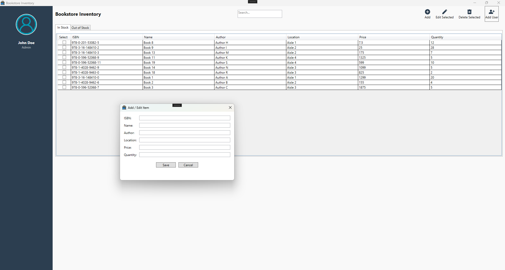

# InventoryTrackingSystem

## Project Overview
The Inventory Tracking System is a C# and .NET-based application developed within ITU's scope of Object-Oriented Programming with C# course. The system provides core functionalities such as adding, updating, deleting, and viewing inventory records, ensuring streamlined business operations. This kind of tracking system is designed to be beneficial for inspecting the stock status of each inventory in a bookstore.

## Technology Stack

***Language:*** C#

***Framework:*** .NET Core

***Database:*** PostgreSQL (AWS RDS)
> PostgreSQL database server is set up using AWS RDS. All data is stored in the server.

***UI Framework:*** Windows Presentation Foundation (WPF)
> WPF (Windows Presentation Foundation) is chosen for the inventory tracking system because it offers a robust and modern framework for building desktop applications within the .NET ecosystem.

***Version Control:*** Git

## Installation and Setup

Clone the Repository:
```
git clone https://github.com/ecemerdogan/InventoryTrackingSystem.git
```

Navigate to the Project Directory:
```
cd InventoryTrackingSystem\BookstoreInventoryTracking
```

Install Dependencies:
```
dotnet restore
```

Run the Application:
```
dotnet run
```

Accounts:
```
admin: password123 (Admin)
user1: password456 (Mod)
user2: password789 (Mod)
```

## Log-in Window
Here is the login window of our Bookstore Inventory Tracking System. Choose one of the given account information to log in to the Inventory Tracking System to access the inventory data.
<p align="center">
  
</p>

## Main Window
In the main window, you can access, edit, delete existing/outdated book information registered in the system, and enter a new inventory. If you chose the "admin" role as entrance information, in addition to all the other users' properties, you will have a chance to add a new user to the system.
<p align="center">
  
</p>

## Add User & Add Book 
To add a user or a book, the necessary information is given below. While adding books, you cannot change ISBN number!!
<p align="center">
  
  
</p>

